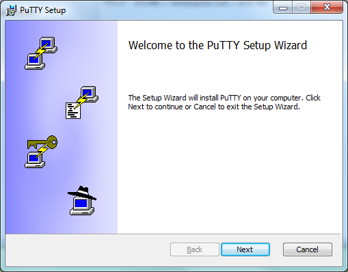
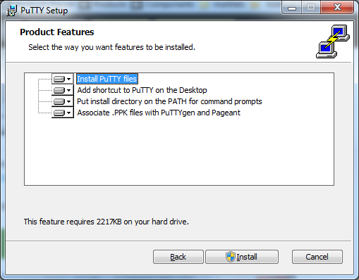
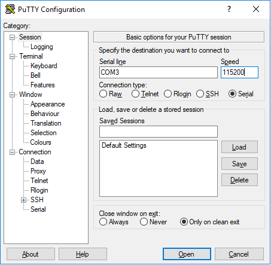

## Flashing Amazon FreeRTOS compiled firmware to your ESP32 board 

1. Download and install Silicon Labs [CP2104 drivers](https://www.silabs.com/products/development-tools/software/usb-to-uart-bridge-vcp-drivers)

2. Connect your ESP32 DevKitC board to the laptop using provided USB cable and identify which port it is connected to
On Windows it will be ```COM3``` for example, on Mac OS typically it enumerated as ```/dev/tty.SLAB_USBtoUART``` and on Linux most likely ```/dev/ttyUSB0```

3. Install [esptool](https://github.com/espressif/esptool) and flash the firware

**Windows**
- Download binary from [here](https://dl.espressif.com/dl/esptool-2.3.1-windows.zip)
- Drop it to the subfolder that already in your PATH or add subfolder you placed esptool to your PATH variable
- Open Commnd Prompt and execute following command (from the directory you places 3 downloaded files):
```
esptool --chip esp32 --port COM3 --baud 921600 --before default_reset --after hard_reset write_flash -z --flash_mode dio --flash_freq 40m --flash_size detect 0x1000 bootloader.bin 0x20000 aws_demos.bin 0x8000 partitions_example.bin
```

**Mac/Linux**
- Install esptool.py:
```bash
sudo pip install esptool pyserial
```
- Execute following command from the directory you placed 3 downloaded files:
```bash
esptool.py --chip esp32 --port /dev/tty.SLAB_USBtoUART --baud 921600 --before default_reset --after hard_reset write_flash -z --flash_mode dio --flash_freq 40m --flash_size detect 0x1000 bootloader.bin 0x20000 aws_demos.bin 0x8000 partitions_example.bin
```
4. Monitor the flashing process:

```bash
bash-3.2$ esptool.py --chip esp32 --port /dev/tty.SLAB_USBtoUART --baud 921600 --before default_reset --after hard_reset write_flash -z --flash_mode dio --flash_freq 40m --flash_size detect 0x1000 bootloader.bin 0x20000 aws_demos.bin 0x8000 partitions_example.bin
esptool.py v2.5.1
Serial port /dev/tty.SLAB_USBtoUART
Connecting........__
Chip is ESP32D0WDQ5 (revision 1)
Features: WiFi, BT, Dual Core
MAC: 24:0a:c4:23:de:7c
Uploading stub...
Running stub...
Stub running...
Changing baud rate to 921600
Changed.
Configuring flash size...
Auto-detected Flash size: 4MB
Flash params set to 0x0220
Compressed 21936 bytes to 13046...
Wrote 21936 bytes (13046 compressed) at 0x00001000 in 0.2 seconds (effective 1145.0 kbit/s)...
Hash of data verified.
Compressed 628432 bytes to 398564...
Wrote 628432 bytes (398564 compressed) at 0x00020000 in 5.9 seconds (effective 854.5 kbit/s)...
Hash of data verified.
Compressed 3072 bytes to 119...
Wrote 3072 bytes (119 compressed) at 0x00008000 in 0.0 seconds (effective 3255.9 kbit/s)...
Hash of data verified.

Leaving...
Hard resetting via RTS pin...
```

5. Monitor code execution through the serial console

**Windows**

5.1.1 Install PuTTY

- You can download putty from http://www.putty.org/ or http://www.chiark.greenend.org.uk/~sgtatham/putty/download.html

5.1.2 Run Installation wizard



5.1.3 Check all options



5.1.4 Setup the port and speed (Port ```COM3``` and ```115200``` in our case)



5.1.5 Open console access to ESP32


**Mac/Linux**

5.2.1 Use ```screen``` command to see the ESP32 console:

```bash
screen /dev/tty.SLAB_USBtoUART 115200
```

5.2.2 In order to exit screen press ```Ctrl + A``` and then ```K```
